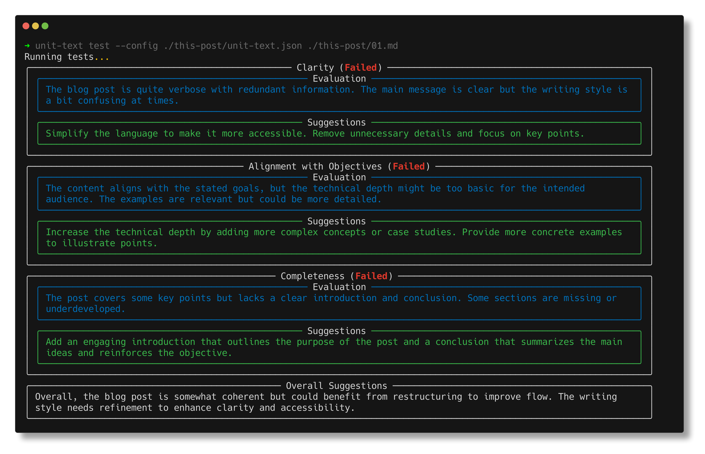

<h1 align="center">unit-text</h1>
<h3 align="center">Unit tests for plain text</h3>

<p align="center">
    <a  href="https://pypi.org/project/unit-text/">
        
    </a>
</p>

<div align="center">


</div>

---

Don't let LLMs write blog posts for you. Do your research, bring your own voice,
and use LLMs to criticise and iterate on your writing.

## 🤌 Why unit-text?

If you're a developer like us:

- You're probably aware you should write more (either because your leadership asks for it,
  or because you'd like to be invited as a conference speaker, or <insert your own reason here>...)
- You don't know what to write about.
- You have considered letting ChatGPT write blog posts for you.

If you tried the last option (or read anything on the Internet in the past 2 years)
you would also know why it's not really that good of an idea.

Sure, you may get a perfectly good post, but it won't be your own.

`unit-text` applies the concept of unit tests to prose. You are the one writing, the LLM is just your critic.

First, you define a goal, the audience you have in mind,
and what you wanted them to do differently after they read your post.
Then, you start writing and iterating on your draft. `unit-text` gives you feedback: you run _tests_
to validate whether your draft is going in the right direction.

An AI copy editor, you could say.

## ⚙️ Installation

[We recommend](https://sealambda.com/blog/hygienic-python-in-2025) [uv](https://github.com/astral-sh/uv) to run the CLI.

```bash
# to run the CLI straight away
uvx unit-text --help

# or if you prefer to install it
uv tool install unit-text
```

You may of course also use `pip` to install the CLI - or `pipx` if you prefer to install it in an isolated environment.

```bash
pipx install unit-text

# ...or if you like to live on the edge
pip install unit-text
```

## 🔨 Usage

### Requirements

Either:

- [Ollama](https://ollama.com) must be running locally;
- `OLLAMA_HOST` should point to an Ollama server.

```bash
# To generate a blog idea
unit-text ideate

# To validate the working draft
unit-text test <path-to-the-draft.md>
```

## 📝 Process

The ideation phase is where you define your blog idea. It looks something like this:


Your idea is now stored in a `unit-text.json` file, in the current directory.

You may run `unit-text ideate` again at any time to finetune it.

Now you can start writing, let's say you're writing in a file called `draft.md`.

At any time, you can run `unit-text test draft.md` to validate it.
Initially, it may look something like this:



Keep iterating on your draft, based on feedback from `unit-text`, until it passes all tests:


## 💻 Contributing

If you want to contribute to the project, please read the [CONTRIBUTING.md](./CONTRIBUTING.md) file.

It contains information on how to set up your development environment, submit issues, and create pull requests.

## 📜 License

This project is licensed under the AGPLv3 License. See the [LICENSE](LICENSE) file for details.
